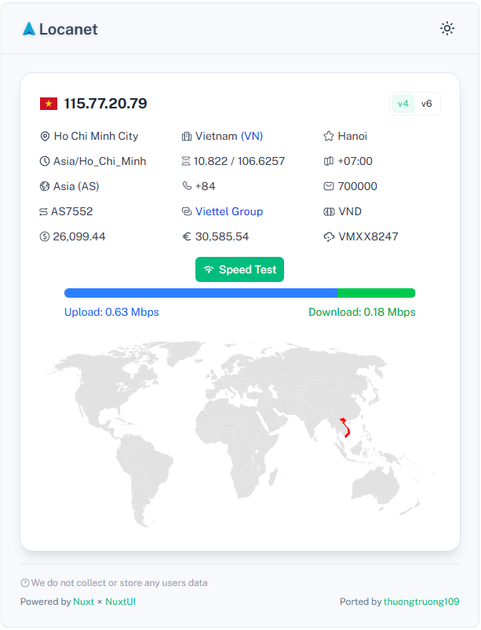

    
    
Detect user access location information along with IP address

    
    
      
    

## References

- Server-Side Rendering with [Nuxt](https://nuxt.com/docs/getting-started/ssr)
- User interface made with [Nuxt UI](https://ui.nuxt.com) x [Nuxt Icon](https://icon.nuxt.com)
- Cache invalidation and Optimistic UI with [Pinia Nuxt](https://pinia.esm.dev) x [Pinia Colada](https://pinia-colada.esm.dev)
- Map visualization with [svgmap](https://www.npmjs.com/package/svgmap)
- Icon support with [Nuxt Icon](https://icon.nuxt.com) x [Iconify](https://icon-sets.iconify.design/)

<!-- https://www.iplocation.net/ip-lookup -->
<!-- https://img.icons8.com/fluency/21/gps-device.png -->
<!-- https://github.com/vinosamari/sportswire -->

<!-- https://www.bigdatacloud.com/free-api/public-ip-address-api
https://www.ddnspod.com/
https://seeip.org/
https://api.iplocation.net/get-ip
https://www.ipify.org/
https://www.ip2location.com/cn
https://ipwhois.io/documentation
https://ip-api.com/docs/api:json#test
http://ip-api.com/json/115.77.20.79
http://ipwho.is/115.77.20.79
https://6.ident.me/json
https://6.tnedi.me/json
https://api.iplocation.net/?cmd=get-ip
https://api.iplocation.net/?cmd=ip-country&ip=115.77.20.79
https://api.iplocation.net/?ip=8.8.8.8 -->
<!-- https://ipinfo.io/json -->
